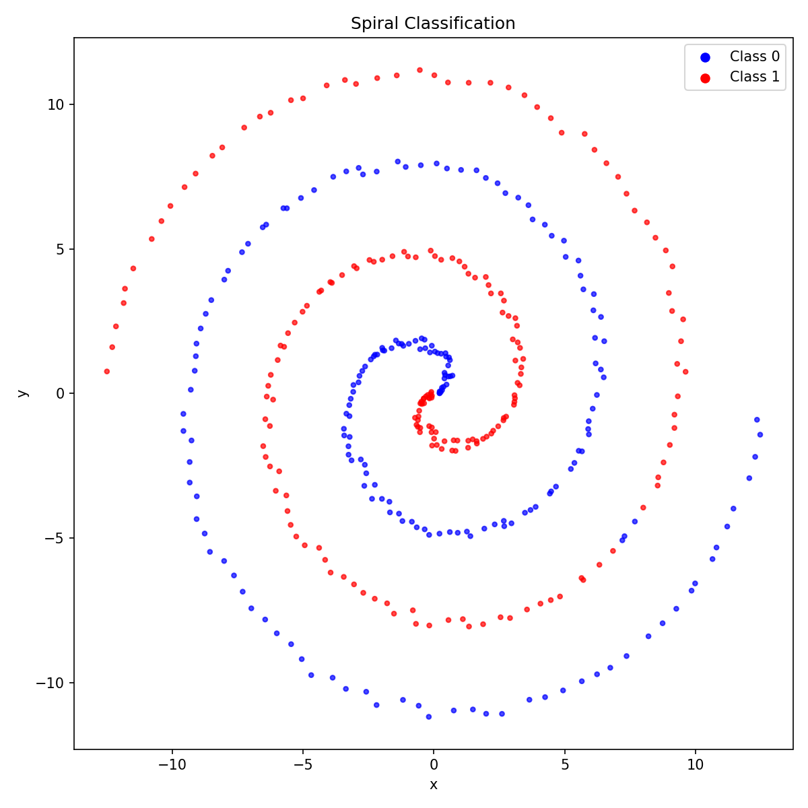

# mllib

A PyTorch-style autograd library written in C11. Full training from creating NN layers to backprop, with no dependencies beyond the C standard library.

Built as a learning project for myself to make sure I don't lose my machine learning background from uni. The long-term goal is a chess evaluation network, wiring the evaluator into a chess game that I made

**[Devlog](https://panu-hietanen.github.io/mllib/devlog)** · **[Chess engine](https://github.com/panu-hietanen/chess_engine)**
---

## How it works

The library is built around four core types:

**Arena allocator** — all memory comes from two arenas: a permanent one (`arena_p`) for weights and Adam moments, and a temporary one (`arena_t`) for activations and graph nodes. After each training step, `arena_clear(arena_t)` clears all the data that isn't required for the next step. Inspired by [Magicalbat](https://www.youtube.com/@Magicalbat) who made a video about arena allocation.

**Tensor** — a 2D array that owns its data and a gradient buffer. Implements matrix multiplication, add with broadcasting, ReLU, sigmoid, softmax, and loss functions.

**Computation graph** — every `graph_*` call creates a `Node` storing pointers to up to two input tensors and a backward function. `backward()` does a topological DFS sort and calls each node's backward function in reverse order.

**Optimizer** — SGD and Adam.

---

## Example: spiral classifier

The two-spiral problem — two interleaved spirals that are not linearly separable — used to validate the library end-to-end.



A two-layer network (sigmoid + BCE) learns to classify it. Weights are saved to CSV and can be reloaded to resume training:

```bash
cmake --preset linux-release && cmake --build --preset linux-release
cd out/build/linux-release
./spiral_bce
```

---

## Python bindings

To make this even more like PyTorch, I wanted to be able to train in python using the standard techniques. I used ctypes for this as it seemed like the easiest to get started with. The arenas are hidden inside the `Model` class, leaving memory management out of the picture here (in classic python fashion).

An example training script can be found [here](python/training_test.py)

### Quick start
```python
from mllib.nn import Model, Linear, ReLU

model = Model(
    layers=[Linear(781, 256), ReLU(), Linear(256, 1)],
    loss="sigmoid_bce",
    lr=1e-3,
)

loss = model.forward(X, y)   # X: np.ndarray (batch, features)
model.backward()
model.step()                 # Adam update + arena clear

model.save("weights/chess")
model.load("weights/chess")  # full resume including optimizer state
```

---

## Chess evaluation network

The end goal is a neural network trained on Stockfish evaluations, allowing me to output the evaluation for a given board state.

**Dataset:** `chessData.csv`: Taken from the [chess-evaluations](https://www.kaggle.com/datasets/ronakbadhe/chess-evaluations) dataset on Kaggle.

**Feature encoding [781 binary features per position]:**
- 0–767: piece positions (12 piece types × 64 squares)
- 768: side to move
- 769–772: castling rights
- 773–780: en passant file

**Training details:**
- Architecture: 781 -> 256 -> 1, sigmoid output
- Loss: sigmoid + BCE
- Labels: soft labels so equal positions target 0.5 rather than a hard 0/1
- Data augmentation: we can choose to have every position mirrored (colors swapped, ranks flipped, label negated). This was implemented as I found that the training put a lot of weight on who had the current move.

---

## Build

Requires CMake and Ninja.

```bash
# Debug (with AddressSanitizer)
cmake --preset linux-debug && cmake --build --preset linux-debug

# Release (builds libmllib.so for Python bindings)
cmake --preset linux-release && cmake --build --preset linux-release
```

Build output directory is `out/build/<preset>/`.

---

## Background
 
Built to try to use my theoretical knowledge from my Engineering degree. The devlog at the top covers the full design process (including the mistakes).
 
[LinkedIn](https://www.linkedin.com/in/panuh/) · panu.hietanen@gmail.com
